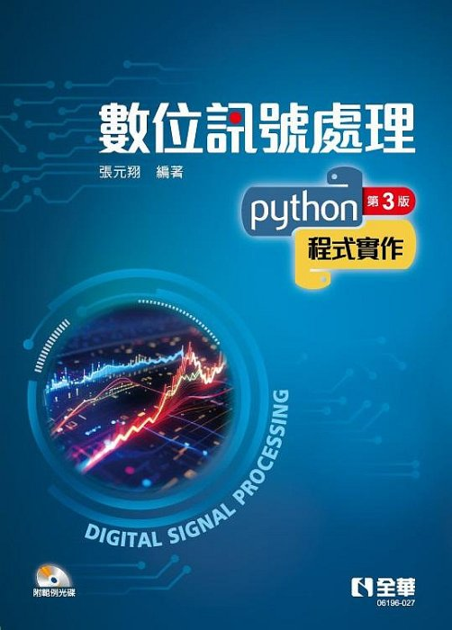

# 數位訊號處理－Python 程式實作 (第三版)
# Digital Signal Processing with Python Programming

<p align="center">
  
</p>

Official Python source codes accompanying the textbook

---

# 📖 About

本 Repository 收錄《數位訊號處理－Python 程式實作》一書之完整 Python 範例程式。

本書以 Python 為工具，詳細介紹數位訊號處理（Digital Signal Processing, DSP）的理論、技術與應用，內容涵蓋 DSP 基礎理論、演算法設計、音訊處理以及實際應用。透過大量 Python 程式範例，協助讀者理解數學原理並培養實務研發能力。

本 Repository 將持續更新與維護。

---

# ✨ Features

- 📘 DSP 理論完整介紹
- 🐍 全書採用 Python 程式設計
- 🎵 大量音訊處理實作
- 💻 每章均提供完整 Python 原始程式
- 📈 理論與實作並重
- 🎯 適合作為 DSP 課程教材與自學參考

---

# 📚 Table of Contents

| Chapter | Content |
|----------|---------|
| Chapter 1 | 介紹 (Introduction) |
| Chapter 2 | 類比訊號 (Analog Signals) |
| Chapter 3 | 數位訊號 (Digital Signals) |
| Chapter 4 | 訊號生成 (Signal Generation) |
| Chapter 5 | 雜訊 (Noise) |
| Chapter 6 | DSP 系統 (DSP Systems) |
| Chapter 7 | 卷積 (Convolution) |
| Chapter 8 | 相關 (Correlation) |
| Chapter 9 | 傅立葉級數與轉換 (Fourier Series & Fourier Transform) |
| Chapter 10 | z 轉換 (z-Transform) |
| Chapter 11 | FIR 濾波器 |
| Chapter 12 | IIR 濾波器 |
| Chapter 13 | 頻譜分析 (Spectrum Analysis) |
| Chapter 14 | 頻率響應 (Frequency Response) |
| Chapter 15 | 頻率域 DSP |
| Chapter 16 | 濾波器設計 |
| Chapter 17 | 時頻分析 (Time-Frequency Analysis) |
| Chapter 18 | 小波轉換 (Wavelet Transform) |
| Chapter 19 | DSP 技術應用 |

---

# 📂 Repository Structure

```text
DSP-Python
│
├── Ch01
├── Ch02
├── Ch03
├── Ch04
├── Ch05
├── Ch06
├── Ch07
├── Ch08
├── Ch09
├── Ch10
├── Ch11
├── Ch12
├── Ch13
├── Ch14
├── Ch15
├── Ch16
├── Ch17
├── Ch18
├── Ch19
└── README.md
```

---

# 🐍 Python Environment

Recommended Python Version

```
Python 3.10+
```

Required packages

```
numpy
scipy
matplotlib
opencv-python
librosa
soundfile
PyWavelets
```

Install packages

```bash
pip install -r requirements.txt
```

---

# 📖 Book Information

**Book Title**

數位訊號處理－Python 程式實作

**ISBN**

978-626-328-796-9

**Publisher**

全華圖書股份有限公司

---

# 📑 Chapters

### Chapter 1 Introduction

- Signals
- Systems
- Signal Processing
- DSP Applications
- Audio File Formats
- Python Programming

### Chapter 2 Analog Signals

- Sine Waves
- Complex Numbers
- Complex Exponential Signals
- Phasors

### Chapter 3 Digital Signals

- Sampling
- Quantization
- Digital Audio
- Real-time Visualization

### Chapter 4 Signal Generation

- Periodic Signals
- Aperiodic Signals

### Chapter 5 Noise

- Uniform Noise
- Gaussian Noise
- Brownian Noise
- Impulse Noise
- Signal-to-Noise Ratio

### Chapter 6 DSP Systems

- DSP Operations
- Sampling Rate Conversion
- Audio DSP

### Chapter 7 Convolution

- Linear Convolution
- Audio Filtering

### Chapter 8 Correlation

- Cross Correlation
- Auto Correlation
- Applications

### Chapter 9 Fourier Analysis

- Fourier Series
- Fourier Transform
- DTFT
- DFT

### Chapter 10 z-Transform

- z Transform
- Transfer Functions
- Poles and Zeros

### Chapter 11 FIR Filters

- FIR Theory
- FIR Design
- FIR Applications

### Chapter 12 IIR Filters

- Impulse Response
- Step Response
- IIR Applications

### Chapter 13 Spectrum Analysis

- Fourier Spectrum
- Power Spectral Density

### Chapter 14 Frequency Response

- Filter Types
- Frequency Response

### Chapter 15 Frequency Domain DSP

- Ideal Filters
- Spectrum Shifting
- Frequency Domain Processing

### Chapter 16 Filter Design

- Window Functions
- FIR Design
- IIR Design

### Chapter 17 Time-Frequency Analysis

- Short-Time Fourier Transform (STFT)
- Spectrogram
- Audio Time-Frequency Analysis

### Chapter 18 Wavelet Transform

- Continuous Wavelet Transform
- Discrete Wavelet Transform
- Wavelet Audio Processing

### Chapter 19 DSP Applications

- Digital Music Synthesis
- Speech Synthesis
- Speech Recognition

---

# 🎓 Intended Audience

- Electrical Engineering
- Electronic Engineering
- Computer Science
- Artificial Intelligence
- Digital Signal Processing
- Audio Signal Processing
- Self-learning

---

# 👨‍🏫 Author

**Yuan-Hsiang Chang (張元翔)**

Professor

Department of Information & Computer Engineering

Chung Yuan Christian University

---

# 📄 License

The Python source codes are provided for educational and academic purposes.

Please respect the copyright of the textbook.

The contents of the textbook may not be reproduced or redistributed without permission from the copyright holder.

---

# ⭐ Citation

If you use this repository in your teaching or research, please cite the corresponding textbook.

---

**Happy Coding! 🐍**
